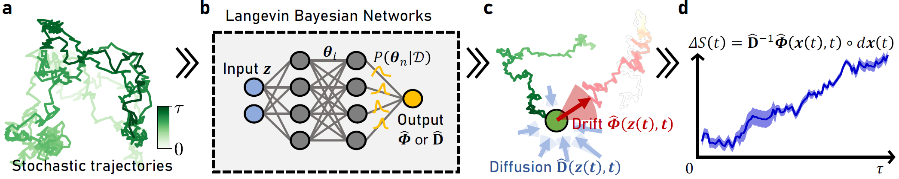

# Inferring the Langevin Equation with Uncertainty via Bayesian Neural Networks

[](https://arxiv.org/abs/2402.01338)

Authors: Youngkyoung Bae, Seungwoong Ha, and Hawoong Jeong

This repository contains the official implementation of ``Inferring the Langevin Equation with Uncertainty via Bayesian Neural Networks``.

## Summary
Pervasive across diverse domains, stochastic systems exhibit fluctuations in processes ranging from molecular dynamics to climate phenomena. The Langevin equation has served as a common mathematical model for studying such systems, enabling predictions of their temporal evolution and analyses of thermodynamic quantities, including absorbed heat, work done on the system, and entropy production. However, inferring the Langevin equation from observed trajectories is a challenging problem, and assessing the uncertainty associated with the inferred equation has yet to be accomplished. In this study, we present a comprehensive framework that employs Bayesian neural networks for inferring Langevin equations in both overdamped and underdamped regimes. Our framework first provides the drift force and diffusion matrix separately and then combines them to construct the Langevin equation. By providing a distribution of predictions instead of a single value, our approach allows us to assess prediction uncertainties, which can help prevent potential misunderstandings and erroneous decisions about the system. We demonstrate the effectiveness of our framework in inferring Langevin equations for various scenarios including a neuron model and microscopic engine, highlighting its versatility and potential impact.

<center></center>

## Getting started

We implemented our algorithm (basically) with ``Python 3.6.13`` and ``PyTorch==1.10.2``.

```
git clone https://github.com/qodudrud/LBN.git
```

## Bibtex
Cite the following BibTeX.
```bibtex
@article{bae2024inferring,
  title={Inferring the Langevin Equation with Uncertainty via Bayesian Neural Networks},
  author={Bae, Youngkyoung and Ha, Seungwoong and Jeong, Hawoong},
  journal={arXiv preprint arXiv:2402.01338},
  year={2024}
}

```
